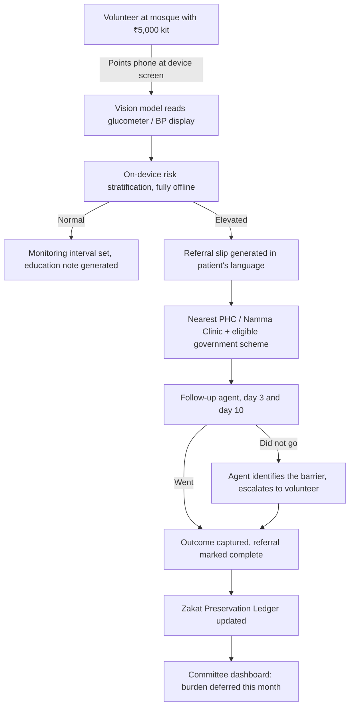
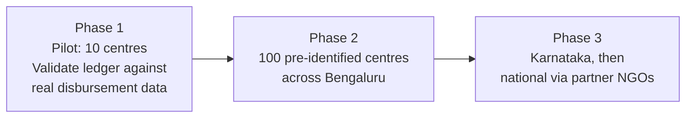

# Sehat Ledger
### Zakat is no longer arriving as charity. It is arriving as a bill.

**Track:** Ummah
**Team:** Active Bengaluru Foundation (ABF)
**Built at:** Algorism № 001, Bengaluru, 26 July 2026

---

## The one line

Community zakat and sadaqah funds are being consumed by late-stage diabetes and hypertension complications that were preventable at a screening cost of ₹12 to ₹15 per person. Sehat Ledger is an offline-first, AI-driven screening tool that turns a mosque volunteer with a low-end Android phone into a preventive health worker, and measures every screening as zakat capital preserved.

---

## 1. The zakat problem nobody has costed

Ask any mosque committee in Bengaluru where the medical relief fund goes. The answer is almost never preventive care. It goes to:

- Dialysis, three sessions a week, indefinitely
- Cardiac procedures and post-stroke care
- Diabetic foot amputations and vision loss
- Hospital bills for a breadwinner who collapsed without warning

These are the terminal stages of two conditions, diabetes and hypertension, that are silent for years and detectable in ninety seconds with a ₹5,000 kit.

Charity is meant to be given at a moment of choice. What committees are doing now is not that. The amount is fixed by a hospital, the schedule is fixed by a dialysis machine, and it repeats every month whether the fund can carry it or not. **That is not charity. That is a bill, and the community is servicing it.**

**The status quo is not neutral. It is an active drain.** Every month a committee funds one dialysis patient is a month that fund is not building a school, supporting orphans, or paying rent for a widow. The money is not wasted, it is spent on the most expensive possible moment in the disease.

> **The zakat arithmetic**
>
> One community member on maintenance dialysis consumes **₹1,58,880 per year** in committee support.
>
> At **₹12 to ₹15 per screening**, that same amount funds **10,600 to 13,200 screenings**.
>
> **The support for one dialysis patient, for one year, would screen every person across all 100 centres in the ABF network.**

Read that last line again, because it is the entire argument.

The fund is not choosing between prevention and treatment. It is paying for treatment at a rate that would have covered prevention for the whole city network, and it is paying it every year, for years, for one person. Meanwhile the next dialysis patient is already in the congregation, undiagnosed, ten years into a silent disease, and nobody has taken their blood sugar.

The tragedy is not that the money is spent. Committees should support their sick. The tragedy is that the same money, spent ten years earlier, would have gone twenty thousand times further.

This is the reframe. Sehat Ledger is not a health app that happens to serve Muslims. It is a **zakat preservation instrument** that works by preventing the expenses that consume the fund.

---

## 2. Why this team can build it and others cannot

The technology in this project is not the hard part. Reaching people is.

ABF already has what no team can assemble in a day:

| Asset | Status |
|---|---|
| Pre-identified mosques and community centres in Bengaluru | 100 |
| Mosque committee and jamaat relationships | Existing, active |
| Trained volunteer network | In place |
| Costed diagnostic kit, sourced locally | ₹5,000, validated |
| Consumable economics per screening | ₹12 to ₹15, validated |

A screening tool without distribution reaches nobody. Distribution without a tool cannot scale past a clipboard. ABF has the harder half already.

**AI is the baseline here, not the differentiator. The distribution is the differentiator.**

---

## 3. The screening flow, end to end

**The loop only closes at K.** A referral issued is not an outcome. Most community screening programmes stop at F and report the number of slips handed out. That number is not connected to anything.

---

## 4. Where AI does the actual work

Four places, all in the built flow, none of them decorative.

**a) Vision capture removes the literacy barrier.**
The volunteer points the camera at the glucometer or BP monitor screen. A vision model reads the digits and fills the record. No typing on a cracked screen, no transcription errors, no requirement that the volunteer be comfortable with forms. This is the single largest cause of data loss in community screening programmes and it is solved by pointing a camera.

**b) Language generation removes the counselling barrier.**
A referral slip that says "HbA1c elevated, consult physician" is useless to the person holding it. The model generates the referral and the counselling script in the patient's own language, Kannada, Urdu, Hindi or Tamil, pitched at their literacy level, naming the specific clinic, the specific scheme they qualify for, and what to say when they arrive. A volunteer with no medical training can hand this over and explain it.

**c) A follow-up agent closes the referral loop.**
This is where every community screening programme in India quietly fails. People get screened, receive a slip, and never go. The programme reports impressive screening numbers while health outcomes stay flat, because a referral that nobody acts on is a piece of paper.

An agent contacts the patient on WhatsApp in their own language on day three and again on day ten. It asks whether they went. If they did, it captures what the doctor said and whether medication was collected. If they did not, it does not repeat the reminder, it finds out why, and the reason is almost never indifference:

| What the patient says | What the agent does |
|---|---|
| "I do not know where it is" | Sends the location, the timings, and what to say at the desk |
| "I cannot take a day off" | Surfaces the nearest clinic with evening or Sunday hours |
| "I could not afford it" | Confirms the scheme they qualify for and what it covers |
| "I do not think it is serious" | Restates the finding in plain terms, offers to speak to a family member |
| No reply after two attempts | Escalates to the volunteer who screened them, with the history attached |

The agent never diagnoses, never prescribes, and never changes medication. It routes people to care and removes the obstacle in front of them.

**d) Risk-to-burden modelling produces the ledger.**
Each risk profile maps to a projected complication pathway. The model estimates the community care burden associated with that trajectory if left unscreened, and credits the difference to the ledger **only once the referral is confirmed complete.** This is what converts a health record into a zakat figure a committee treasurer can act on.

> **Honesty note for judges:** day-one risk stratification is a deterministic rules engine calibrated to ICMR thresholds, not a trained model. Calling it a model would be inaccurate. The vision and language layers are genuine model calls. The learned risk classifier requires screening volume we do not yet have, and is on the roadmap in section 8.

---

## 5. The Zakat Preservation Ledger

This is the part that belongs to the Ummah track and the part no other screening tool has.

Every screening writes a line to a committee-level ledger:

- Screenings performed this month
- High-risk individuals identified before symptom onset
- **Referral completion rate**, confirmed by the follow-up agent, not slips issued
- **Projected community care burden deferred, in rupees**

The treasurer opens one screen and sees what the fund did not have to spend. Preventive health becomes measurable in the same unit the committee already thinks in.

**The follow-up agent is what makes the ledger honest.** Without confirmed referral completion, the burden-deferred figure would be a number generated from a piece of paper handed to someone who may have thrown it away. Ledger credit is only written when the agent confirms the person reached care. That is a smaller number than the alternative and it is the only defensible one.

The figure remains a projection and is labelled as one everywhere it appears. Understating it is safer than overstating it, and the model is tuned accordingly.

---

## 6. Consent, privacy, and scope

Health data collected by volunteers on personal devices demands this section, not a footnote.

- **Consent** is captured verbally in the patient's language and recorded in the record before any reading is taken. The script is generated by the same language layer. Consent to be contacted for follow-up is captured as a separate opt-in, and declining it does not affect the screening.
- **The follow-up agent identifies itself** as an automated assistant from the ABF programme in its first message, every time. It stops permanently on request. It never discusses a patient's condition with anyone other than the patient.
- **This is screening, not diagnosis.** Every referral slip and every screen carries that statement. No condition is ever named to a patient. The output is always "see a doctor about this," never "you have diabetes."
- **Storage** is local-first and encrypted. Sync to the central store happens over TLS when connectivity returns. Volunteer devices retain no records after sync.
- **Access** is role-scoped at the database layer. A volunteer sees only records they created. Committee dashboards show aggregates, never individual records.
- **DPDP Act 2023** treats this as sensitive personal data. Purpose limitation, consent, and erasure on request are designed in rather than retrofitted.
- Screening data is never shared with commercial parties in any form, aggregate or otherwise.

---

## 7. Operating model

**Who screens.** Trained volunteers drawn from the existing mosque committee and jamaat networks. The kit requires no clinical qualification: digital BP apparatus, glucometer, weighing scale, stadiometer.

**Who screens women.** A separate women volunteer cohort recruited through jamaat women's wings, operating in women's sections and at women's community gatherings. Same kit, same tool, same training. Screening coverage that excludes half the community does not reduce community care burden, so this is not an afterthought in the rollout sequence.

**Device requirement.** Low-end Android, offline capable. The tool must work on a ₹6,000 phone with no connectivity, because that is what volunteers actually carry.

---

## 8. What was built today, and what was not

Scope honesty matters more than scope ambition.

**Built at Algorism:**
- Vision capture of glucometer and BP readings
- Offline screening record with on-device risk stratification
- Multilingual referral and counselling slip generation
- Follow-up agent with barrier identification and volunteer escalation
- Zakat Preservation Ledger with committee dashboard, gated on confirmed referral completion
- Seeded with anonymised sample records so the dashboard is legible

**On the follow-up agent specifically:** the agent logic, conversation handling, barrier classification and escalation path are live. The WhatsApp Business API approval cycle is longer than a build day, so the demo runs the real agent against a simulated message thread rather than the live channel. Production deployment substitutes the channel, not the system.

**Not built today, on the roadmap:**
- Offline voice input in Kannada, Urdu, Hindi and Tamil
- Learned risk classifier, requires screening volume
- Geospatial density mapping to target intervention by cluster
- Live PHC and Namma Clinic availability integration
- Automated benefit eligibility checks against Ayushman Bharat and state schemes

---

## 9. Sustainability

The screening stays at no charge for anyone who cannot pay, permanently.

Cross-subsidy: the identical screening is offered to middle and upper-middle income residents at ₹50. At mass volume this covers consumables for the community programme without touching the zakat fund.

No commercial partnerships involving screening data, in any form. The programme's credibility with mosque committees is the asset, and it does not survive that trade.

---

## 10. Roadmap

Phase 1 exists to test one claim: does the projected burden deferred match what committees actually stop spending. If the ledger does not hold up against real disbursement records, the model gets corrected before it scales, not after.

---

## Sources and figures

| Figure | Status |
|---|---|
| NCDs account for roughly 60 to 66 percent of deaths in India | Cite WHO / ICMR-GBD directly |
| Cardiovascular disease share of total deaths | **Verify before use.** The commonly cited figure for CVD as a share of all deaths in India is closer to 28 percent. A figure near 32 percent may describe CVD share of NCD deaths rather than total deaths. Confirm the denominator. |
| ₹5,000 diagnostic kit | ABF field-costed, Bengaluru, 2026 |
| ₹12 to ₹15 per screening in consumables | ABF field-costed, Bengaluru, 2026 |
| ₹1,58,880 annual support per dialysis patient | ABF, Bengaluru, 2026. **Record the derivation:** sessions per week, rate per session, and whether the figure includes transport, medication and lost earnings or dialysis alone. |
| 10,600 to 13,200 screenings equivalent | Arithmetic from the two figures above |

The two costing figures are ABF's own and are the strongest numbers in this document precisely because they are observed rather than cited. Label them that way.

---

## Demo, two minutes

1. Volunteer takes a live blood sugar reading on a real glucometer.
2. Points the phone at the device screen. The value fills itself.
3. Risk flags elevated. Phone is in airplane mode throughout.
4. Referral slip generates in Urdu, naming the nearest Namma Clinic and the scheme the patient qualifies for.
5. **Jump forward three days.** The follow-up agent messages the patient. Reply: "I could not go, the clinic is closed by the time I finish work." The agent does not repeat itself. It finds the nearest clinic with evening hours and sends the new details.
6. **Day ten.** Patient confirms they went and collected medication. Referral marked complete.
7. Only now does the committee dashboard move: one high-risk case caught early, confirmed in care, ledger increments.

One person, one phone, no connectivity at the point of screening, and a loop that does not close until someone actually reaches a doctor.
