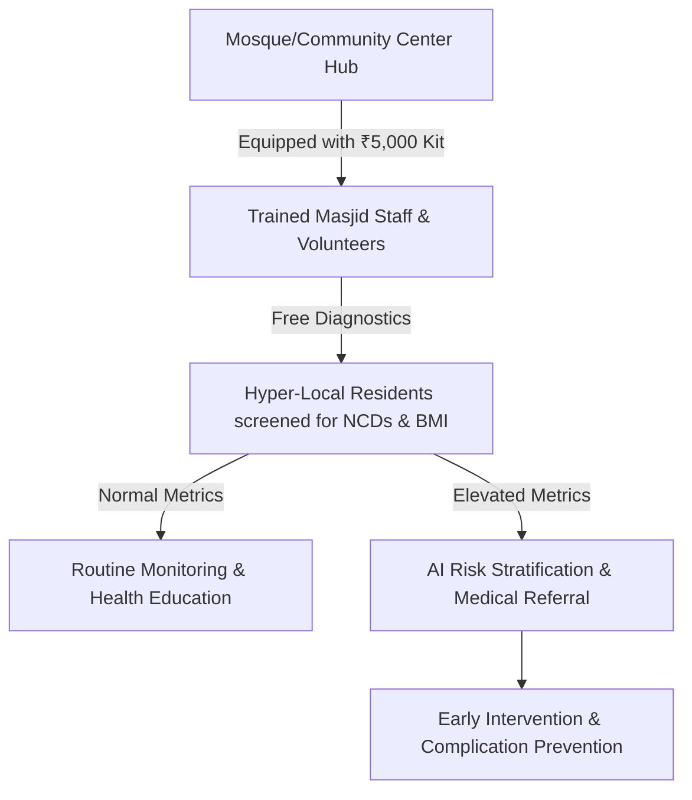
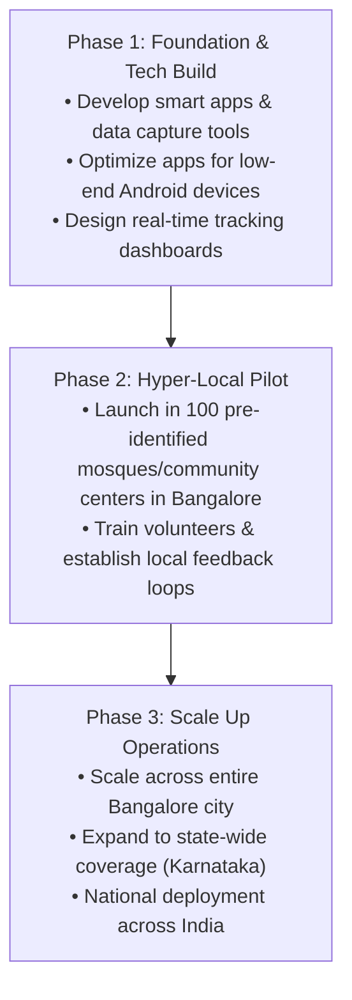

# ABF Community NCD Prevention Initiative: AI Hackathon Business Strategy

## Executive Summary
The **Active Bengaluru Foundation (ABF)** is launching a hyper-local, preventive health program designed to combat Non-Communicable Diseases (NCDs) like diabetes and hypertension. By leveraging the existing networks of mosque committees, jamaats, and NGOs, and equipping trained local volunteers with low-cost diagnostic kits (~₹5,000/kit), this initiative aims to identify high-risk individuals early. 

The goal of this **AI Hackathon Strategy** is to design, build, and deploy smart digital solutions that amplify volunteer capabilities, automate data collection on low-end Android devices, predict high-risk clusters, and seamlessly connect screened individuals with medical professionals to prevent debilitating, high-cost health complications (dialysis, blindness, cardiovascular events).

---

## 1. Problem Statement: India's Primary Health Threat
* **The Global Capital of NCDs:** India is now recognized as the diabetes and hypertension capital of the world. 
* **High Fatality Rate:** NCDs are India’s primary health threat, accounting for roughly **60% to 63% of all deaths** in the country. Among these, cardiovascular diseases alone cause **32.1%** of all fatalities.
* **Rapidly Rising Prevalence:** Diabetes and hypertension represent high metabolic risk factors impacting tens of millions, particularly concentrated in rapidly growing urban and poverty-stricken brackets.
* **The Community Burden:** When an individual's health worsens, the social and economic burden inevitably cascades back onto the community itself through shared charity, loss of productivity, and dependent families.

---

## 2. Economic & Social Impact on Urban Poor
The economic impact of NCDs on communities in urban poverty-stricken brackets is devastating, frequently causing catastrophic health expenditures and severe household impoverishment. 
* **The Debt Trap:** Because NCDs are chronic and require lifelong care, they trap low-income urban families in a cycle of debt and multi-generational poverty.
* **Family Devastation:** The progression to late-stage NCDs (e.g., dialysis, loss of eyesight, stroke, heart failure) destroys the livelihood of primary breadwinners, leaving families financially destitute.

---

## 3. The Solution: Hyper-Local Preventive Screening at Mass Scale
Instead of waiting for patients to visit distant hospitals, ABF brings mass-scale diagnostics directly to the community level.

### Community Leverage Network
We will scale outreach and build instant trust by leveraging:
* Mosque Committees (local administration)
* Various Jamaats (community networks)
* Local NGOs and healthcare groups

---

## 4. Equipment Economics & Recurring Costs
The business model is highly cost-effective and designed for long-term sustainability:
* **Durable Capital:** The diagnostic equipment in the ₹5,000 kit (digital BP apparatus, Glucometer, weighing scale, Stadiometer) is durable and will easily last for **at least a couple of years**.
* **Ultra-Low Recurring Cost:** At mass scale, the recurring cost for testing each patient is only **₹12 to ₹15** for consumables (batteries, gluco testing strips, lancets, alcohol swabs, etc.).

---

## 5. Hackathon Core Themes: Where AI Adds Value
Solutions developed during the hackathon must prioritize being **intuitive and user-friendly**, specifically optimized to run smoothly on **low-end Android mobile devices** common among volunteers.

### Track A: Intuitive Data Capture & Accessibility (UI/UX)
* **Computer Vision OCR:** Scan pictures of glucometer/BP screens to auto-populate readings, removing manual data entry hurdles.
* **Offline-First Voice Input:** Speech-to-text in local languages (Kannada, Urdu, Hindi, Tamil) that works under poor network conditions.

### Track B: Risk Stratification & Hotspotting (Analytics)
* **Low-Data Risk Profiler:** Classify patients into risk categories based on age, habits, BMI, and vital metrics.
* **Geospatial Density Mapping:** Visualize NCD hotspots for targeted community intervention.

### Track C: Care Continuity & Referral Systems (Government Integration)
* **Smart Triaging & Referral:** AI-assisted digital referral slips that locate and guide patients to the nearest government Primary Health Centers (PHCs) or Namma Clinics.
* **Benefit Navigation Assist:** Simple guided navigation in local languages showing patients what government healthcare schemes (e.g., Ayushman Bharat, state-specific benefits) they are entitled to for their condition.

---

## 6. Financial Sustainability & Monetization Models
While the core initiative is a free service for the economically weaker sections, the program can be monetized and sustained in multiple ways:

1. **Cross-Subsidization (Freemium Model):** Offer the exact same screening services to middle-class and upper-middle-class individuals for a nominal fee of **₹50 per screening**, cross-subsidizing and keeping it completely free for whoever cannot afford it.
2. **Branding & Marketing Sponsorships:** Partner with health-conscious brands and medical services for targeted marketing, wellness sponsorships, and co-branded health awareness campaigns.

---

## 7. Strategic Roadmap

> [!IMPORTANT]
> **Key Hackathon Success Metric:** The winning solution must be lightweight, run on low-end Android smartphones offline or with minimal internet connectivity, and require zero technical expertise from the Masjid volunteers.
