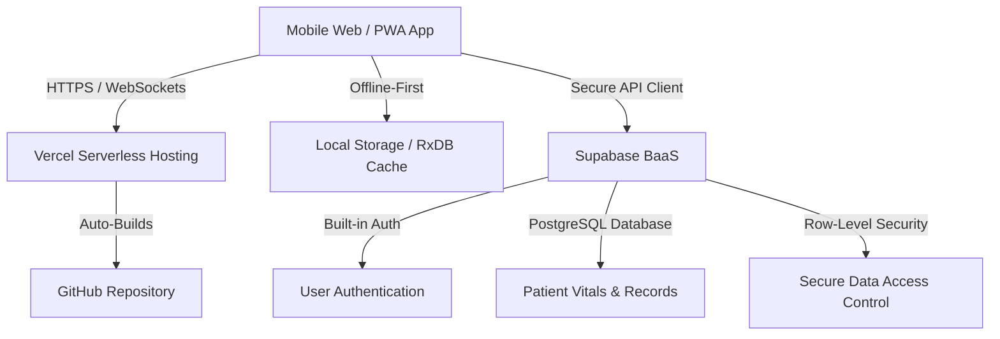

# ABF Community Health Hub: End-to-End Tech Stack Recommendation

To build this NCD screening tool so it is **lightweight, offline-capable, secure, highly scalable**, and can be **built and deployed entirely via AI without technical DevOps knowledge**, we recommend a **Serverless + Backend-as-a-Service (BaaS)** architecture.

---

## The End-to-End Architecture

---

## 1. The Frontend: Vite + React (with Tailwind CSS)
While Svelte is slightly lighter, **React + Tailwind** is the absolute best choice for an **AI-driven development workflow**.

* **Why AI-Friendly:** LLMs are trained on more React and Tailwind code than any other frontend stack. An AI will write bug-free, mobile-responsive React components much faster and more reliably.
* **Vite:** A build tool that compiles the application in milliseconds and keeps the production bundle size extremely small.
* **Tailwind CSS:** Allows the AI to write inline styling directly in HTML tags, eliminating complex CSS file management.

---

## 2. The Backend & Security: Supabase (Serverless BaaS)
Setting up traditional backends (Node.js, Python, databases, servers) requires high technical knowledge. **Supabase** removes this entirely.

* **Database (PostgreSQL):** Enterprise-grade, highly scalable database ready to store millions of patient records.
* **Authentication:** Built-in email/password or OTP login for Masjid staff and volunteers out of the box.
* **Security (Row-Level Security):** You can write simple rules (e.g., *"Volunteers can only read/write data from their own mosque"*). This ensures patient privacy compliance with zero backend programming.
* **AI-Friendly:** Supabase has a built-in SQL AI assistant that lets you generate database tables and security rules using plain English.

---

## 3. Offline Capabilities: Progressive Web App (PWA)
Since volunteers may work in poor network areas, the app must operate offline.

* **Vite PWA Plugin:** With one config file (written by AI), the website can be "installed" on Android phones as a native app.
* **Offline Synchronization:** The app stores records in the browser's local cache if there is no internet, and automatically syncs them to Supabase once a connection is detected.

---

## 4. Hosting & Deployment: Vercel + GitHub (Zero-DevOps)
This is the key to maintaining the system without technical knowledge.

* **How it works:** You connect your Vercel account to your GitHub repository (`ABF-lab/Health`). 
* **Zero Config:** Every time you or an AI pushes code changes to GitHub, Vercel automatically builds and publishes the website live. If something breaks, you can roll back to a working version with a single click in the Vercel dashboard.

---

## Summary of the Tech Stack

| Layer | Recommended Technology | Why it fits the ABF Hackathon |
| :--- | :--- | :--- |
| **Frontend** | **React.js + Tailwind CSS** (via Vite) | Most reliable for AI code generation; fully mobile-first. |
| **Backend & Database** | **Supabase** | Zero server setup; secure by default; auto-generates database APIs. |
| **Offline Engine** | **Vite PWA Plugin** | Enables offline data entry and app installation on cheap Androids. |
| **Hosting** | **Vercel** | Free tier; automatic deployment on Git push; no server config. |
