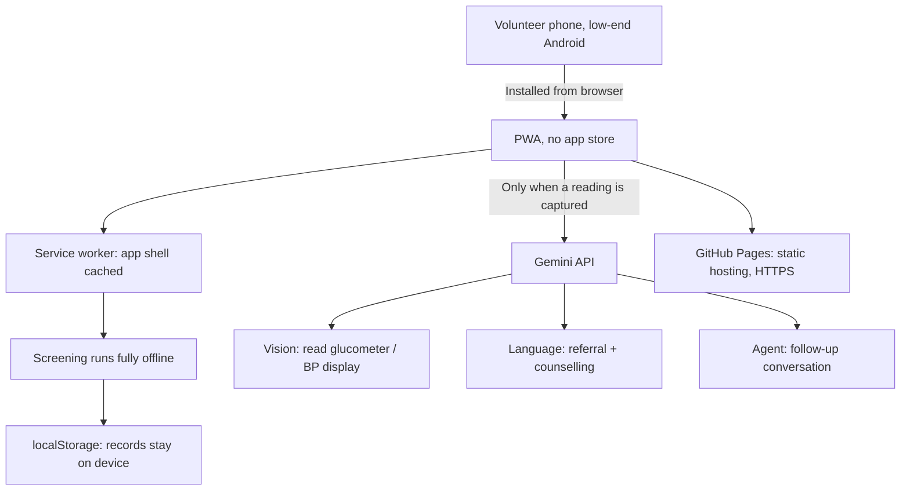

# Sehat Ledger: Technical Architecture

*Supersedes the pre-build recommendation. This describes what was actually built, not what was planned.*

---

## The constraint that decided everything

A volunteer in a basement prayer hall with no signal, on a phone that cost less than the diagnostic kit, must be able to complete a screening. Every architectural choice below follows from that one sentence.

That constraint rules out more than it rules in. No login wall. No network round-trip in the critical path. No framework that ships 200KB before the first screening. No build step that has to succeed before anyone can fix a bug on the day.

---

## Architecture

---

## 1. Frontend: vanilla ES modules, no framework

**React was the original recommendation. It was the wrong call, and here is why.**

| | React + Vite | What was built |
|---|---|---|
| Install size | ~140KB before any app code | 0KB framework |
| Build step | Required before anything runs | None |
| Fix a bug at 6pm on build day | Edit, rebuild, redeploy, hope | Edit the file, refresh |
| Who can contribute | Whoever knows React | Anyone who can read HTML |

The whole application is 3,200 lines across six ES modules loaded natively by the browser. No bundler, no transpiler, no `node_modules`, no lockfile. `git push` is the deploy.

For a build day with a mixed-skill team and a hard 8pm deadline, removing the build step removes an entire category of failure.

**Module boundaries:**

| File | Responsibility |
|---|---|
| `clinical.js` | IDRS, BMI, BP, glucose, outcome escalation. Pure functions, no DOM, no network. Independently testable. |
| `ledger.js` | The zakat preservation model. Every assumption is a named constant. |
| `ai.js` | All three Gemini calls, each with a deterministic mock fallback. |
| `app.js` | Routing, screening flow, camera, threads, rendering. |
| `sw.js` | Offline shell. |
| `styles.css` | Design system. |

`clinical.js` and `ledger.js` have no dependencies on anything else in the project. That is deliberate: the two files a clinician or a treasurer would want to audit are the two files they can read without understanding the rest.

## 2. Storage: on-device only

`localStorage`, holding a JSON array of screening records.

No backend. No database. No accounts. No sync.

This is not a shortcut, it is the privacy design. Health data collected by volunteers never leaves the handset, so there is no server to breach, no credentials to leak, and no third party in the chain. The airplane-mode demo is not a simulation of offline capability; it is how the application actually runs.

**What this trades away:** multi-volunteer aggregation and a central committee dashboard. Both are on the roadmap and both need a backend. Neither is needed to prove the screening loop works.

**Migration path:** the record shape is already a flat, serialisable object. Moving to Supabase with row-level security is an additive change, writing through to the same objects that already exist locally.

## 3. AI: Google Gemini

Three calls, each with a structured JSON response schema so the output is parsed, not scraped:

| Call | Model job |
|---|---|
| `readDeviceScreen` | Vision. Reads digits from a glucometer or BP monitor. Instructed to refuse rather than guess when the display is unclear, because a wrong vital sign is worse than no vital sign. |
| `generateReferral` | Referral slip and counselling script in Urdu, Kannada, Hindi or Tamil, at the reader's literacy level. |
| `followUpTurn` | The follow-up agent. Classifies the barrier, decides the action, escalates to a volunteer. |

**Every call degrades to a labelled mock.** No key, no signal, or a rate limit returns realistic simulated output that says on screen that it is simulated. A demo that dies because the venue wifi died is not a demo, and output that silently pretends to be live is worse than no output.

**Key handling:** entered by the operator at runtime, stored in `localStorage` on the device, never committed. On a public deployment it is a client-side key and must be referrer-restricted in AI Studio and rotated after the event. A production deployment moves the call behind a proxy.

## 4. Offline: service worker

Cache-first for the app shell. Model calls are explicitly never cached, because a stale vital sign is a clinical hazard.

The worker checks for an update on every load, activates immediately, and reloads once when the new version takes control. A cache-first worker that serves yesterday's JavaScript forever looks exactly like "my changes did nothing", which cost real time during this build.

## 5. Hosting: GitHub Pages

Static files, HTTPS, zero configuration, deploy on push.

HTTPS is not optional here. Browsers only expose `getUserMedia` and service workers on a secure context, so **without HTTPS there is no camera and no offline mode.** A LAN IP will not do.

## 6. Distribution: no app store

Installed from the browser via the web manifest. Appears on the Android home screen with its own icon and no browser chrome.

For an NGO this is the point. Rolling out to 100 centres means sending a link or printing a QR code. No Play Store review, no signing keys, no update rollout, no volunteer needing an account to install anything.

---

## Summary

| Layer | Choice | Why |
|---|---|---|
| Frontend | Vanilla ES modules | No build step, anyone can fix it, zero framework weight |
| Styling | One CSS file, custom properties | No preprocessor, no purge step |
| Type | Inter, self-hosted variable, 48KB | Linked fonts fail with no signal |
| Storage | `localStorage` | No backend means no breach surface |
| AI | Gemini, structured output | Strong vision plus Indic language coverage |
| Offline | Service worker, cache-first | The field has no connectivity |
| Hosting | GitHub Pages | HTTPS required for camera and install |
| Install | PWA from browser | 100 centres, no app store |

Total payload: **357KB**, including the typeface, the logo and the background artwork.
